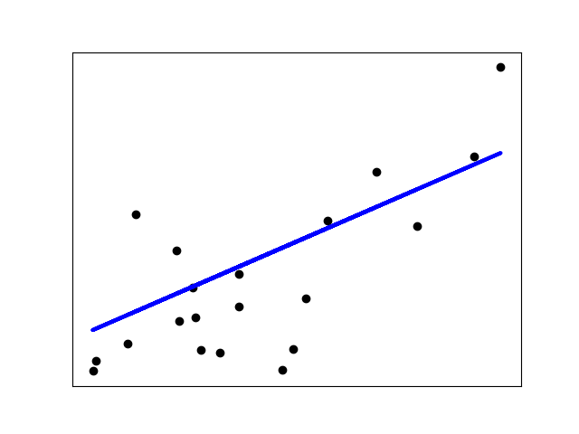

=============
Examples
=============

The following are a set of methods intended for regression in which
the target value is expected to be a linear combination of the features.
In mathematical notation, if :math:`\hat{y}` is the predicted
value.

.. math::    \hat{y}(w, x) = w_0 + w_1 x_1 + ... + w_p x_p

Across the module, we designate the vector :math:`w = (w_1,
..., w_p)` as ``coef_`` and :math:`w_0` as ``intercept_``.

To perform classification with generalized linear models

Ordinary Least Squares
=======================

:class:`LinearRegression` fits a linear model with coefficients
:math:`w = (w_1, ..., w_p)` to minimize the residual sum
of squares between the observed targets in the dataset, and the
targets predicted by the linear approximation. Mathematically it
solves a problem of the form:

.. math:: \min_{w} || X w - y||_2^2

:class:`LinearRegression` will take in its ``fit`` method arrays ``X``, ``y``
and will store the coefficients :math:`w` of the linear model in its
``coef_`` member::

    >>> from sklearn import linear_model
    >>> reg = linear_model.LinearRegression()
    >>> reg.fit([[0, 0], [1, 1], [2, 2]], [0, 1, 2])
    LinearRegression()
    >>> reg.coef_
    array([0.5, 0.5])

The coefficient estimates for Ordinary Least Squares rely on the
independence of the features. When features are correlated and the
columns of the design matrix :math:`X` have an approximately linear
dependence, the design matrix becomes close to singular
and as a result, the least-squares estimate becomes highly sensitive
to random errors in the observed target, producing a large
variance. This situation of *multicollinearity* can arise, for
example, when data are collected without an experimental design.

.. rubric:: List Example

* item 1
* item 2

