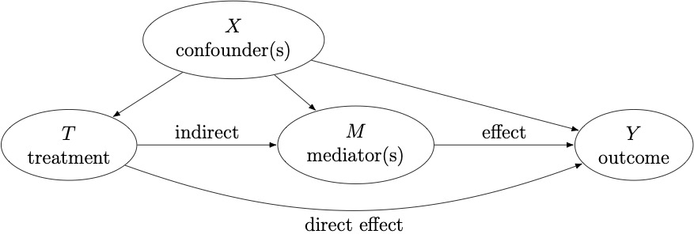

.. med_bench documentation master file, created by
   sphinx-quickstart on Tue Apr  9 16:50:56 2024.
   You can adapt this file completely to your liking, but it should at least
   contain the root `toctree` directive.

.. title:: Home

.. toctree::
    :hidden:
   :maxdepth: 2

.. currentmodule:: med_bench

.. toctree::
   :hidden:

   install
   estimation_guide
   reference/index
   auto_examples/index
   

Mediation Benchmark
=========

**med_bench** is a Python library for **causal mediation analysis**. 

Causal mediation analysis
----------
Mediation analysis breaks down the causal effect of a **treatment** (T) on an outcome (Y) into an indirect effect, acting through a third group of variables called mediators (M), and a direct effect, operating through other mechanisms.

For each individual, we denote the (binary) treatment ``T``, the observed outcome ``Y``, the observed mediator(s) ``M``, and the covariate(s) ``X``; covariates associated with at least two variables among the treatment, mediator(s) and outcome are confounders and should be adjusted for.

Extending the potential outcomes framework, in the case of a binary treatment, we can define :math:`M(t)` and :math:`Y(t, M(t))` the potential mediator and the potential outcome under the treatment value :math:`t \in \{0, 1\}`. 

We then define the total average treatment effect (ATE) as:

.. math::

    \tau = \mathbb{E}[Y(1, M(1)) - Y(0, M(0))] \label{ate_equation}

To further decompose the total effect into natural direct and indirect effects, we define cross-world potential outcomes that correspond to varying the treatment, while maintaining the value of the mediator to the value it would have without changing the treatment, and the converse. Contrary to the previously mentioned potential outcomes, where one of them is observed, cross-world outcomes can never be observed.

Those additional terms allow us to define the natural direct effect as

.. math::

   \theta(t) = \mathbb{E}[Y(1, M(t)) - Y(0, M(t))], \;\;\;\;t \in \{0, 1\},

and the natural indirect effect

.. math::

    \delta(t) = \mathbb{E}[Y(t, M(1)) - Y(t, M(0))], \;\;\;\;t \in \{0, 1\}.

If the identification assumptions are valid in your setting, you can proceed with the estimation step, and use one of the estimators implemented in `med_bench` to obtain an estimate for your effects of interest.

Mediation estimators
----------

Several estimators have been developed to estimate the natural direct and indirect effects. More details can be found in the Estimation guide section.

Miscellaneous
--------

- License: BSD-3-Clause
- GitHub repository: https://github.com/judithabk6/med_bench
- Status: under development, API is subject to change without notice.

.. admonition:: citation

    Judith Abécassis, Houssam Zenati, Sami Boumaïza, Julie Josse, Bertrand Thirion. Causal mediation analysis with one or multiple mediators: a comparative study. 2025. `hal-05060162 <https://hal.science/hal-05060162>`_

.. image:: logos/inria_logo.png
   :width: 30%
.. image:: logos/logo_soda.png
   :width: 30%
.. image:: logos/logo_mind.png
   :width: 20%
